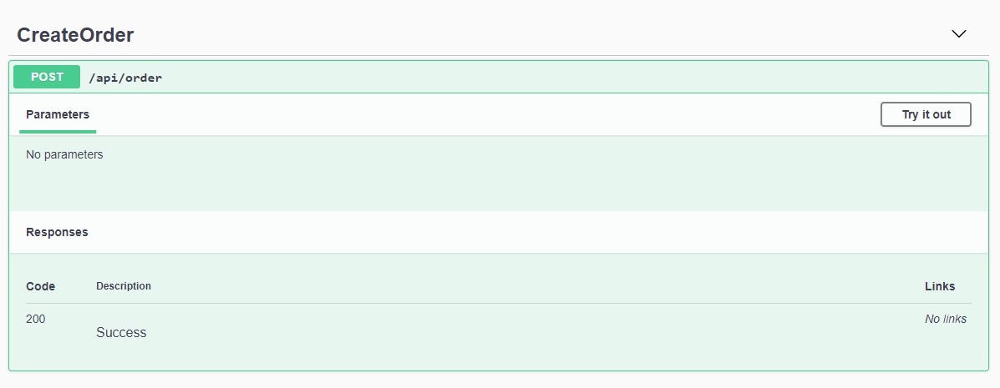
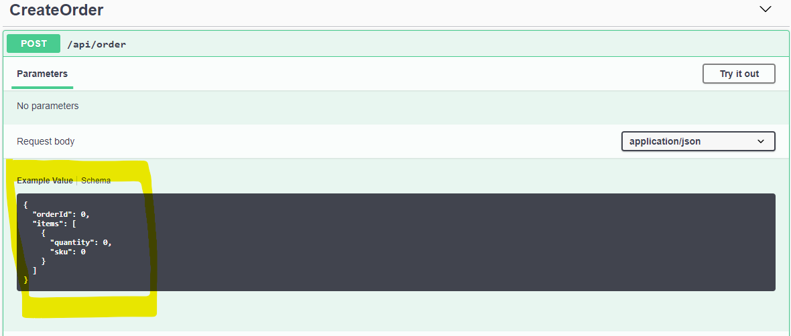
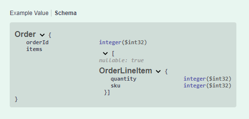
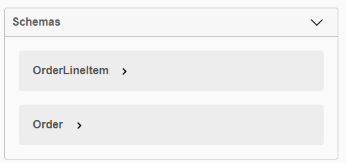
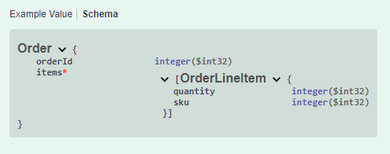
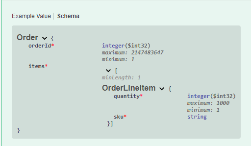

# Better API descriptions with Swashbuckle and Azure Functions

**(This is part 2 of a X part series... )**

I recently worked on an Azure Functions middleware project. The different clients to the APIs needed to be isolated so that each API client had the least amount of access possible. Our clients code in many different technologies (C#, Python, Java, etc). To document our APIs for these clients, we chose to use [OpenAPI (formerly Swagger)](https://swagger.io).

For the sake of these articles, we will be working with a fictitious shopping site called “Bmazon” and handle sending orders to the warehouse and the warehouse sending shipping information back.

In this series of articles, I will walk you through:

1.  ~~Creation of the Project~~
1.  ~~Addition of OpenAPI spec generation~~
1.  Increasing the Quality of the Documentation that is generated
1.  Generation of separate documents based on consumer and the access they should have
1.  Exposing these separate Consumer APIs as separate APIs in Azure API Management (?)

This article covers step 3 of this list

## The Problem

In the [LINK] previous article, we got the Azure Functions application to start generating OpenAPI docs for our functions, but something was missing:



Here you can see that, even though the `CreateOrder` call takes an `Order` object in the body of the HTTP Post, there is no documentation describing this. This is not very helpful. It also only documents that the function will return a 200 status. If we add data validation to this method, we may wind up returning a 400 (Bad Request). We could also possibly return a 409 (Conflict) if the order already exists.

## The Solution: Better Documentation

In order for the OpenAPI documentation to be much better, we need to add a few things that Swashbuckle will use to generate better docs

Swashbuckle only has access to the definition of your function in order to generate documentation, so the following translates to very little information. It doesn't even mention the `Order` type deserialized in the body of the method

```csharp
    [FunctionName("CreateOrder")]
    public async Task<IActionResult> Run(
        [HttpTrigger(AuthorizationLevel.Anonymous, "post", Route = "order")]
        HttpRequestMessage req,
        ILogger log)
```

### Tell Swashbuckle the Body Type

To document the type expected in the body of the POST, we need to tell Swashbuckle what to expect. We do this by using the `RequestBodyType` attribute from the `AzureFunctions.Extensions.Swashbuckle.Attribute` namespace.

Note that this is an _additional_ attribute on the HttpRequestMessage parameter

```csharp
    [FunctionName("CreateOrder")]
    public async Task<IActionResult> Run(
        [HttpTrigger(AuthorizationLevel.Anonymous, "post", Route = "order")]
        [RequestBodyType(typeof(Order), "The Order To Create")] // Describe the Body
        HttpRequestMessage req,
        ILogger log)
```

With this in place, we now see that the body type is present in the UI:



If you click on the "Schema" link, you will even see the data type names being used:



Note that the `Items` array is marked `nullable: true`. We will address that below in the `Data Annotations` section

The bottom of the page also shows you all the current objects in the Schema that are known:



This information documents all the details about the DTOs being used in this API.

### Data Annotations

Above, the `Order`'s `Items` collection was marked as nullable. We want to fix that and other validation information that Swashbucklet can read. To do that, we add [Data Annotations](https://docs.microsoft.com/en-us/dotnet/api/system.componentmodel.dataannotations?view=netcore-3.1)

Currently, the Order looks like this:

```csharp
public class Order
{
  public int OrderId { get; set; }
  public IEnumerable<OrderLineItem> Items { get; set; }
}
```

In order to tell Swashbuckle (and our clients) that the Items collection is not optional, we have to mark it `[Required]` and `[NotNull]` from the `System.Diagnostics.CodeAnalysis` namespace.
The NotNull attribute is also needed because OpenAPI, not being language-specific, supports the concept of `null` along with the lack of presence of the variable at all. JavaScript developers will relate to this concept with `undefined` and `null` keywords.
So, in order to tell clients that fields MUST have a value, you need to add both attributes

```csharp
  public class Order
  {
    public int OrderId { get; set; }

    [Required, NotNull]
    public IEnumerable<OrderLineItem> Items { get; set; }
  }
```

The results:



Note the red "\*" next to the "items" collection and the lack of the `nullable:true`.

We'll mark the ID, Quantity and SKUs all required as well. Additionally, we'll put rational `[Range]` and other appropriate restrictions as well:

```csharp
public class Order
{
  // if we get to 2 billion orders, we'll all be retired anyway
  [Required, NotNull, Range(1, int.MaxValue)]
  public int OrderId { get; set; }

  [Required, NotNull, MinLength(1)]
  public IEnumerable<OrderLineItem> Items { get; set; }
}

public class OrderLineItem
{
  [Required, NotNull, Range(1, 1000)]
  public int Quantity { get; set; }

  [Required, NotNull, MinLength(1)]
  public string SKU { get; set; } // Changed this to a string because it made more sense
}
```



### XML Comments

One thing that you may notice is that, at the top of the function, there is very little information about the method expect the name (e.g. "CreateOrder").

To give client devs more information about the methods being exposed by an API, we can add C# XML Documentation information to the code and, if configured for it, Swashbuckle will incorporate that too.

So, we will add comments to our methods and our DTOs as follows:
