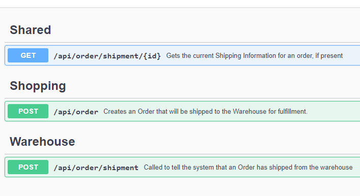
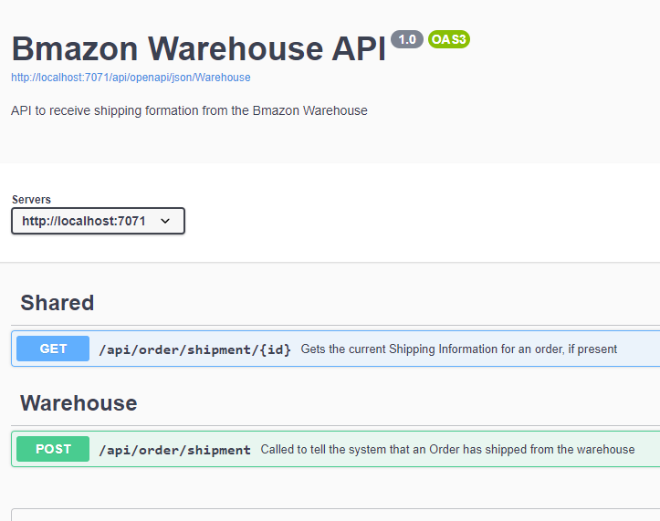

# Generating Separate OpenAPI Documents for Azure Functions with Swashbuckle

**(This is part 3 of a X part series... )**

I recently worked on an Azure Functions middleware project. The different clients to the APIs needed to be isolated so that each API client had the least amount of access possible. Our clients code in many different technologies (C#, Python, Java, etc). To document our APIs for these clients, we chose to use [OpenAPI (formerly Swagger)](https://swagger.io).

For the sake of these articles, we will be working with a fictitious shopping site called “Bmazon” and handle sending orders to the warehouse and the warehouse sending shipping information back.

In this series of articles, I will walk you through:

1.  ~~Creation of the Project~~
1.  ~~Addition of OpenAPI spec generation~~
1.  ~~Increasing the Quality of the Documentation that is generated~~
1.  Generation of separate documents based on consumer and the access they should have
1.  Exposing these separate Consumer APIs as separate APIs in Azure API Management (?)

This article covers step 4 of this list

## We need to lock it down

In the [LINK] previous article, we increased the quality of our OpenAPI spec by adding various C# attributes and XML comments to the mix.

Now, it turns out that our security team alerted us that some folks in the Warehouse were using their access to the "Create Order" API to generate fake orders for themselves. This is a problem and they have now updated the Security Procedures to require restricing people to only knowing about the API calls they are supposed to use.

Now, currently, we have the following functions and groups that need to access them:

| Function              | Description                                      | Shopping Dept | Warehouse |
| --------------------- | ------------------------------------------------ | :-----------: | :-------: |
| Create Order          | Creates an order to ship to the Warehouse        |       ✔       |           |
| Order Shipped         | Shipment update from the Warehouse to the System |               |     ✔     |
| Order Shipping Status | Gets the current shipping status of an order     |       ✔       |     ✔     |

We have 2 Clients (Shopping Dept and Warehouse) that each need acccess to 2 functions.
Since 1 of those functions is shared between the clients, we will need 3 groupings for this.

## Put Functions In Groups

Swashbuckle supports putting things in Groups by using the `ApiExplorerSettings` attribute from the `Microsoft.AspNetCore.Mvc` namespace. This attribute can be applied more than one time as well, so we can add these fo all the functions like this:

```csharp
[ApiExplorerSettings(GroupName = "Warehouse")]
[FunctionName("OrderShipped")]
public async Task<IActionResult> Run(
//...

[ApiExplorerSettings(GroupName = "Shopping")]
[FunctionName("CreateOrder")]
public async Task<IActionResult> Run(
//...

[ApiExplorerSettings(GroupName = "Shared")]
[FunctionName("OrderShippingStatus")]
public async Task<OrderShippingInfo> Run(
//...
```

By itself, putting them into these groups will not separate things into separate documents for you, it will just add a group name to the API method. In the UI this renders like this



## Create Separate API Specs

In order to create separate specs, you need to configure Swashbuckle to generate multiple documents and show it how to divide up the methods.

### Configure the documents

Back to `Startup`, we update the configuration with this

```csharp
builder.AddSwashBuckle(Assembly.GetExecutingAssembly(), opts =>
{
  // incorporate the XML documentation
  opts.XmlPath = "Bmazon.xml";

  // set up the docs with the same names as the group names used in the code
  opts.Documents = new SwaggerDocument[] {
    new SwaggerDocument()
    {
      Name = "Everything",
      Title = "Bmazon Shopping API",
      Description = "API to handle Orders and shipping information for the Shopping   Department",
      Version = "1.0"
    },
    new SwaggerDocument()
    {
      Name = "Shopping",
      Title = "Bmazon Shopping API",
      Description = "API to handle Orders and shipping information for the Shopping   Department",
      Version = "1.0"
    },
    new SwaggerDocument()
    {
      Name = "Warehouse",
      Title = "Bmazon Warehouse API",
      Description = "API to receive shipping formation from the Bmazon Warehouse",
      Version = "1.0"
    }
  };
//...
```

We now have 1 "Everything" that we'll use as a default and 2 others that will be used for their respective Clients.

Now, let's configure Swashbuckle so it knows what to put in what place

### Update the OpenAPI Functions to support individual API Specs

In that same method in the Startup, we also need to add the following

```csharp
opts.ConfigureSwaggerGen = genOpts =>
{
  // configure the separate document inclusion logic
  genOpts.DocInclusionPredicate((docName, apiDesc) =>
  {
    if (docName == "Everything")
    {
      return true;
    }

    if (!apiDesc.TryGetMethodInfo(out MethodInfo methodInfo)) return false;

    // pull the value(s) of the [ApiExplorerSettings(GroupName= "foo")] attribute
    var attr = methodInfo.GetCustomAttributes(true).OfType<ApiExplorerSettingsAttribute>().FirstOrDefault();

    var groupName = attr?.GroupName;

    // always return it if it's shared. Otherwise compare doc names
    return groupName == "Shared" || groupName == docName;
  });
};
```

Now, when you run the functions, you will have the option to have separate API specs for each Client so that they will only know about the APIs they can call and this can be locked down by Azure API Management at a later time.



