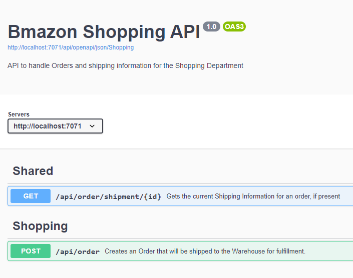

# Creating Self Documenting Azure Functions with C# and OpenAPI: Part Three

This blog series guides you through creating a C# Function App, creating self-documenting APIs, ensuring the quality of that generated documentation, and seperating documentation based on the audience.

The blog post assumes the following:

- You are familiar with C#
- You have knowledge of software development fundamentals
- You are comfortable with command line interfaces
- You have completed [Part Two](./Article%202.md) of this series

This is the final post in this series.

## We Need to Lock it Down

In the [previous article](./Article%202.md), we increased the quality of our OpenAPI spec by adding various C# attributes and XML comments to the mix.

Now, it turns out that our Security Team alerted us that some folks in the Warehouse were using their access to the "Create Order" API to generate fake orders for themselves. This is a problem and they have now updated the Security Procedures to require restricting people to only knowing about the API calls they are supposed to use.

Now, currently, we have the following functions and groups that need to access them:

| Function              | Description                                      | Shopping Dept | Warehouse |
| --------------------- | ------------------------------------------------ | :-----------: | :-------: |
| Create Order          | Creates an order to ship to the Warehouse        |       ✔       |           |
| Order Shipped         | Shipment update from the Warehouse to the System |               |     ✔     |
| Order Shipping Status | Gets the current shipping status of an order     |       ✔       |     ✔     |

We have 2 Clients (Shopping Dept and Warehouse) that each need acccess to 2 functions.
We need to separate these things into 2 groups.

## Put Functions In Groups

Swashbuckle supports putting things in Groups by using the `ApiExplorerSettings` attribute from the `Microsoft.AspNetCore.Mvc` namespace. This attribute can be applied more than one time as well, so we can add these for all the functions like this:

⚠ Since 1 of those functions is shared between the clients, and you can't use more than one `ApiExplorerSettings` attributes per function, we will actually need 3 groupings for this, "Warehouse", "Shopping" and "Shared".

```csharp
[ApiExplorerSettings(GroupName = "Warehouse")]
[FunctionName("OrderShipped")]
public async Task<IActionResult> Run(
//...

[ApiExplorerSettings(GroupName = "Shopping")]
[FunctionName("CreateOrder")]
public async Task<IActionResult> Run(
//...

[ApiExplorerSettings(GroupName = "Shared")]
[FunctionName("OrderShippingStatus")]
public async Task<OrderShippingInfo> Run(
//...
```

By itself, putting them into these groups will not separate things into separate documents for you, it will just add a group name to the API method. In the UI this renders like this


## Create Separate API Specs

In order to create separate specs, you need to configure Swashbuckle to generate multiple documents and show it how to divide up the methods.

### Configure the documents

Back to `Startup.cs`, we update the configuration with this

```csharp
builder.AddSwashBuckle(Assembly.GetExecutingAssembly(), opts =>
{
  // incorporate the XML documentation
  opts.XmlPath = "Bmazon.xml";

  // set up the docs with the 2 specific group names as the group names used in the code
  opts.Documents = new SwaggerDocument[] {
    new SwaggerDocument()
    {
      Name = "Everything",
      Title = "Bmazon Shopping API",
      Description = "All APIs",
      Version = "1.0"
    },
    new SwaggerDocument()
    {
      Name = "Shopping",
      Title = "Bmazon Shopping API",
      Description = "API to handle Orders and shipping information for the Shopping Department",
      Version = "1.0"
    },
    new SwaggerDocument()
    {
      Name = "Warehouse",
      Title = "Bmazon Warehouse API",
      Description = "API to receive shipping formation from the Bmazon Warehouse",
      Version = "1.0"
    }
  };
  //...
```

We now have 1 "Everything" that we'll use as a default and 2 others that will be used for their respective Clients.

Now, let's configure Swashbuckle so it knows what to put in what place

### Update the OpenAPI Functions to support individual API Specs

In that same method in the Startup, we also need to add the following

```csharp
opts.ConfigureSwaggerGen = genOpts =>
{
  // configure the separate document inclusion logic
  genOpts.DocInclusionPredicate((docName, apiDesc) =>
  {
    // if we're generating the "everything" document, then include this method
    if (docName == "Everything")
    {
      return true;
    }

    if (!apiDesc.TryGetMethodInfo(out MethodInfo methodInfo)) return false;

    // pull the value(s) of the [ApiExplorerSettings(GroupName= "foo")] attribute
    var attr = methodInfo.GetCustomAttributes(true).OfType<ApiExplorerSettingsAttribute>().FirstOrDefault();

    var groupName = attr?.GroupName;

    // always return it if it's shared. Otherwise compare doc names
    return groupName == "Shared" || groupName == docName;
  });
};
```

### Add Function Support For Selecting A Group

In order to allow the clients to select a specific group, we need to modify the JSON and UI OpenAPI functions to support
selecting a group.

To do this, we add a new parameter to the JSON and UI Functions called "group" (defaulting ot "Everything")

```csharp
/// <summary>
/// function implementation
/// </summary>
/// <param name="req">the http request</param>
/// <param name="swashbuckleClient">the injected Swashbuckle client</param>
/// <param name="group">the optional document from the URL (default: "Everything"</param>
/// <returns>the JSON data as an http response</returns>
[SwaggerIgnore]
[FunctionName(nameof(OpenApiJson))]
public static Task<HttpResponseMessage> Run(
    [HttpTrigger(AuthorizationLevel.Anonymous, "get", Route = "openapi/json/{group?}")]
    HttpRequestMessage req,
    [SwashBuckleClient] ISwashBuckleClient swashbuckleClient,
    string group)
{
  return Task.FromResult(swashbuckleClient.CreateSwaggerJsonDocumentResponse(req, group ?? "Everything"));
}

/// <summary>
/// the function implemntation
/// </summary>
/// <param name="req">the http request</param>
/// <param name="swashbuckleClient">the injected Swashbuckle client</param>
/// <param name="group">the optional document from the URL (default: "Everything")</param>
/// <returns>the HTML page as an http response</returns>
[SwaggerIgnore]
[FunctionName(nameof(OpenApiUi))]
public static Task<HttpResponseMessage> Run(
    [HttpTrigger(AuthorizationLevel.Anonymous, "get", Route = "openapi/ui/{group?}")]
        HttpRequestMessage req,
    [SwashBuckleClient] ISwashBuckleClient swashbuckleClient,
    string group)
{
  // the CreateOpenApiUIResponse method actually generates the HTTP page from the JSON Function results
  return Task.FromResult(swashbuckleClient.CreateSwaggerUIResponse(
    req, $"openapi/json/{group ?? "Everything"}"));
}
```

Now, when you run the functions, you will have the option to have separate API specs for each Client by appending the document name to the URL, like "http://localhost:7071/api/openapi/ui/Shopping", so that they will only know about the APIs they can call. In order to further lock this down, you can add authorization to the specific endpoints at a later time, possibly with Azure API Management.




## Conclusion

Now you have self-documenting APIs separated into different groupings that you can expose to individual clients.
All you need to do is properly comment your code and decorate the Functions with the proper Attributes and you and
your clients will be very satisfied.
