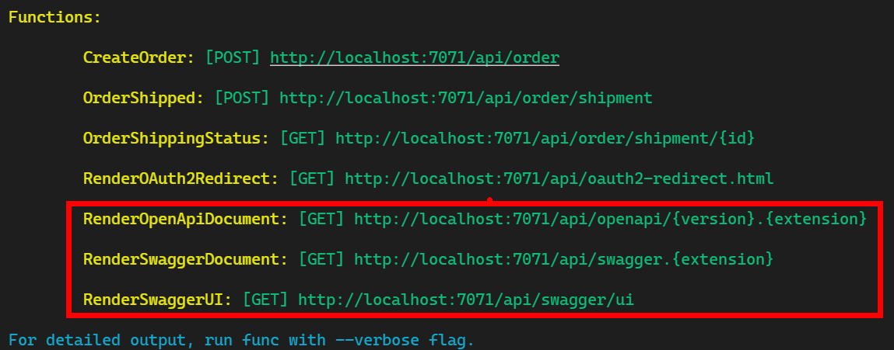

# # Creating Self Documenting Azure Functions with C# and OpenAPI: Update

In the _previous series of articles_, we went over how to create Self-Documenting Azure Functions with C# and OpenAPI with generated OpenAPI specs. At the time, this was done with the current LTS versions, which meant Azure Functions V3 and .NET 3.1.

Since then, .NET 6 and Azure Functions V4 have been released. Along with those, another very useful package has also been released: [Microsoft.Azure.WebJobs.Extensions.OpenApi](https://www.nuget.org/packages/Microsoft.Azure.WebJobs.Extensions.OpenApi/). This package removes the need for many of the extra steps taken in the previous articles.

In this article, I will walk you through the process of upgrading our "Bmazon" application to support .NET 6 and convert our OpenAPI document generation to use the new NuGet package.

## The new OpenAPI Package

The [Microsoft.Azure.WebJobs.Extensions.OpenApi](https://www.nuget.org/packages/Microsoft.Azure.WebJobs.Extensions.OpenApi/) package incorporates a lot of logic that we did in a custom way in the previous posts. Here is a quick comparison of our old approach with this new package:

| Feature                           | Old Way                                                                   | New Way                                         |
| --------------------------------- | ------------------------------------------------------------------------- | ----------------------------------------------- |
| Basic Configuration               | `builder.AddSwashBuckle()` in Startup                                     | Works Auto**magic**ally[^1]                     |
| Create endpoints for UI/docs      | Custom Azure Functions                                                    | Works Auto**magic**ally                         |
| Document Parameters/Return Values | Combination of XML documentation and Attributes from disparate namespaces | OpenAPI Attributes                              |
| Schema/Validation                 | Use Data Annotations                                                      | Use Data Annotations or JsonProperty Attributes |
| Create Separate Documents         | Lots of Custom Startup Code                                               | Not Supported[^2]                               |

[1]: Also customizable by implementing an interface.

[2]: Not really the best approach anyway, since it doesn't restrict users. Better to use separate Function apps or an API Gateway like Azure API Management. For more info on integrating with Azure API Management, see [this article](https://github.com/Azure/azure-functions-openapi-extension/blob/main/docs/integrate-with-apim.md).

## Update Frameworks

We need to update to the latest framework versions (.Net6 and Functions v4).

### Remove global.json

First, if you were using a global.json file to lock things to the dotnet 3.1 version, go ahead and delete that now. Alternately, you could update the contents to lock it to version 6.

### Download the SDKs

You'll need to download and install these:

- [.NET 6 SDK](https://dotnet.microsoft.com/download/dotnet/thank-you/sdk-6.0.101-windows-x64-installer)
- [Azure Functions Core Tools V4](https://go.microsoft.com/fwlink/?linkid=2174087)

### Update the Project

Next, you need to update your `Bmazon.csproj` file to target the new SDKs.

#### Remove XML documentation

Unless you need it for another reason, you can remove the following line from the csproj file:

```xml
  <DocumentationFile>Bmazon.xml</DocumentationFile>
```

#### Old Frameworks

```xml
  <PropertyGroup>
    <TargetFramework>netcoreapp3.1</TargetFramework>
    <AzureFunctionsVersion>v3</AzureFunctionsVersion>
    ...
  </PropertyGroup>
```

#### New Frameworks

```xml
  <PropertyGroup>
    <TargetFramework>net6.0</TargetFramework>
    <AzureFunctionsVersion>v4</AzureFunctionsVersion>
    ...
  </PropertyGroup>
```

Then you need to change your package references as well. We need to add the `Microsoft.Azure.Functions.Extensions` because that was being pulled in as a secondary dependency in the past, but not now.

```powershell
> dotnet remove package AzureExtensions.Swashbuckle
> dotnet add package Microsoft.NET.Sdk.Functions
> dotnet add package Microsoft.Azure.Functions.Extensions
```

This will update the package to the latest versions.

Now we're ready to update the code.

## Update Startup.cs

Configuration is handled differently with the new package, so the entire `builder.AddSwashBuckle` method call should be removed. Your Startup class should look like this now:

```cs
  public class Startup : FunctionsStartup
  {
    public override void Configure(IFunctionsHostBuilder builder)
    {
      builder.Services.AddSingleton<OrderService>();
    }
  }
```

## Update OpenAPI Config

First, the new package automatically creates the Azure Functions for the API endpoints for you, so you can just delete the OpenApiJson and OpenApiUi files from the "OpenApi" folder.

Once those files are removed, you need to add a new class that implements the `IOpenApiConfigurationOptions` interface. The package will find this class at runtime to get its configuration from.

The implementation is quite simple. We are defaulting to OpenAPI V3 and setting the title and API version here. All the rest are effectively defaults

```cs
public class OpenApiConfigurationOptions : IOpenApiConfigurationOptions
{
  public OpenApiInfo Info { get; set; } =
    new OpenApiInfo
    {
      Title = "Bmazon APIs",
      Version = "1.0"
    };

  public List<OpenApiServer> Servers { get; set; } =
    new();

  public OpenApiVersionType OpenApiVersion { get; set; } =
    OpenApiVersionType.V3;

  public bool IncludeRequestingHostName { get; set; } = false;
  public bool ForceHttp { get; set; } = true;
  public bool ForceHttps { get; set; } = false;
}
```

## Use the New Attributes

Since we've switch packages away from the Swashbuckle library, we need to change the attributes we use to annotate our Azure Functions. Follow a few simple steps to update your code.

### OpenApiOperation

`OpenApiOperation` is a new attribute that each API Function needs to be decorated with to designate it as an API. This attribute takes the name of the function along with a description and some optional "tags" to be used for categorizing the function. In our case, we will be adding a tag for the same groupings we used before ("Shopping" or "Warehouse") to designate the target audience.

Here's an example for the `CreateOrder` Function:

```cs
[OpenApiOperation(
    "CreateOrder",
    tags: new[] { "Shopping" },
    Description = "Creates an Order that ...")]
```

### OpenApiRequestBody

Each instance of `RequestBodyType` should be replaced with `OpenApiRequestBody`

Old (attribute on the `HttpRequestMessage` parameter):

```cs
[RequestBodyType(
  typeof(Order),
  "The Order To Create")]
```

New:

```cs
[OpenApiRequestBody(
  contentType: "application/json",
  bodyType: typeof(Order),
  Description = "The Order To Create")]
```

### OpenApiResponseWithBody

Everywhere your code has `ProducesResponseType`, it should be replaced with `OpenApiResponseWithBody`.

Old (description was in the XML comments):

```cs
[ProducesResponseType(
  typeof(string),
  StatusCodes.Status200OK)]
```

New:

```cs
[OpenApiResponseWithBody(
    statusCode: HttpStatusCode.OK,
    contentType: "application/json",
    bodyType: typeof(string),
    Description = "Indicates success and returns a user-friendly message")]
```

### OpenApiResponseWithoutBody

Any API methods/scenarios that do not return a Body in the response should also have an `OpenApiResponseWithoutBody` attribute

```cs
[OpenApiResponseWithoutBody(
    statusCode: HttpStatusCode.OK,
    Description = "Indicates success. Returns no payload")]
```

NOTE: Since the Descriptions for the Responses are now in these attributes, you can remove all the `<response code="XXX">` tags in
your XML comments

### Full Example

Here is a comparison of the entire CreateOrder method definition:

Old:

```cs
[ProducesResponseType(
  typeof(string),
  StatusCodes.Status200OK)]
[ProducesResponseType(
  typeof(IEnumerable<string>),
  StatusCodes.Status400BadRequest)]
[FunctionName("CreateOrder")]
[ApiExplorerSettings(GroupName = "Shopping")]
public async Task<IActionResult> Run(
  [HttpTrigger(AuthorizationLevel.Anonymous, "post", Route = "order")]
  [RequestBodyType(typeof(Order), "The Order To Create")]
  HttpRequestMessage req,
  ILogger log)
{
  ...
}
```

New:

```cs
[OpenApiOperation("CreateOrder",
  tags: new[] { "Shopping" },
  Description = "Creates an Order that will be shipped to the Warehouse for fulfillment.")]
[OpenApiRequestBody(
  contentType: "application/json",
  bodyType: typeof(Order),
  Description = "The Order To Create")]
[OpenApiResponseWithBody(
  statusCode: HttpStatusCode.OK,
  contentType: "application/json",
  bodyType: typeof(string),
  Description = "Indicates success and returns a user-friendly message")]
[OpenApiResponseWithBody(
  statusCode: HttpStatusCode.BadRequest,
  contentType: "application/json",
  bodyType: typeof(IEnumerable<string>),
  Description = "Indicates a data validation issue and will return a list of data validation errors")]
[FunctionName("CreateOrder")]
public async Task<IActionResult> Run(
  [HttpTrigger(AuthorizationLevel.Anonymous, "post", Route = "order")]
  HttpRequestMessage req,
  ILogger log)
{
  ...
}
```

## Test It All

Now that things are all updated, you should be able to build the code with `dotnet build`.

NOTE: If you're updating your own project, you may want to check the Microsoft documentation on [Breaking changes between 3.x and 4.x](https://docs.microsoft.com/azure/azure-functions/functions-versions?tabs=in-process%2Cv4&pivots=programming-language-csharp#breaking-changes-between-3x-and-4x) to be sure there's nothing else you need to be concerned with.

### The new URLs

Once you update everything and run `func host start`, you should see these new URLs replace the old ones:


#### RenderSwaggerUI

This method renders the default view as configured.

#### RenderSwaggerDocument

This URL allows you to download the document directly. Just substitute "{extension}" with either of the supported file extensions (`json` or `yaml`) and it will download the appropriate file

#### RenderOpenApiDocument

If you are looking for a specific OpenAPI version, you can use this URL to do that by adding a supported OpenAPI version ("v2", "v3") along with the extension in order to get that specific version. (e.g. `http://localhost:7071/api/openapi/v2.yaml`)

## Conclusion

Now that we've gone through this exercise, you are now generating Swagger/OpenAPI documents in your Azure Functions in a better way using a Microsoft-recommended approach.

Happy Coding!
