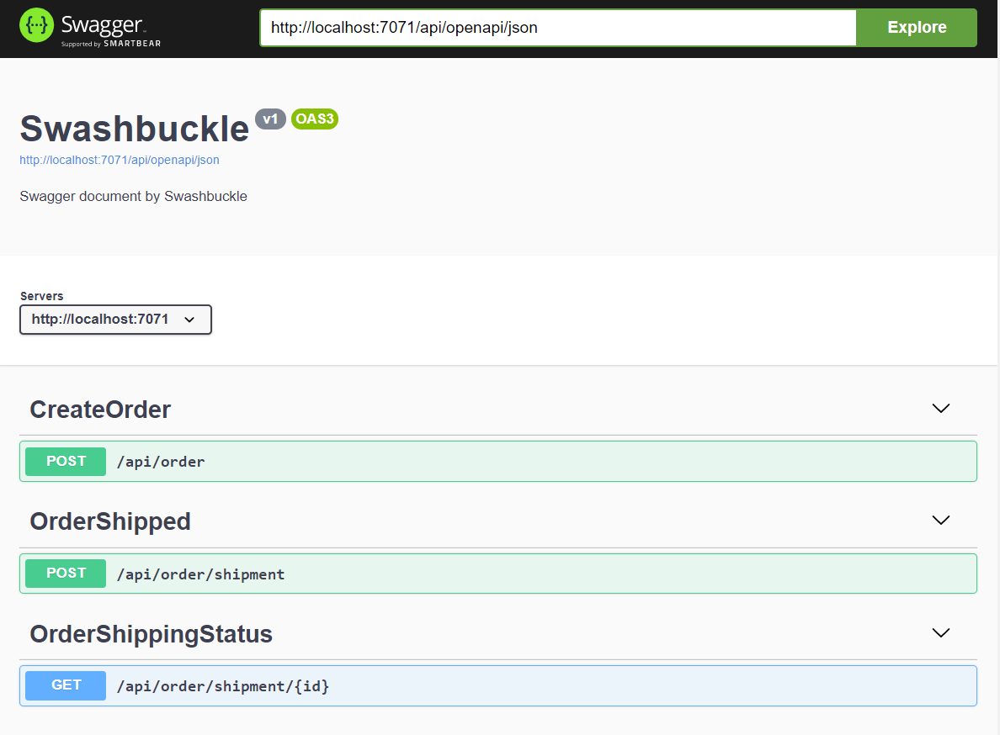

# Creating Self Documenting Azure Functions with C# and OpenAPI: Part One

When migrating existing business services to Azure PaaS as part of an App Modernization project, you may find yourself seriously considering serverless computing using Azure Functions, especially if your target architecture includes MicroServices.

Azure Functions let you focus on what counts -- your requirements, your time and your code -- and less about boilerplate code, infrastructure and processes.

When creating new APIs in any technology, one thing is very important: Documenting those APIs so that others can use them. This is especially important in large enterprises or situations where you are exposing these APIs to the public.

This blog series guides you through creating a C# Function App, creating self-documenting APIs, ensuring the quality of that generated documentation, and separating documentation based on the audience.

The blog series assumes the following:

- You are familiar with C#
- You have knowledge of software development fundamentals
- You are comfortable with command line interfaces

At AIS, we've decided that the best approach to documenting your APIs is to use [OpenAPI (formerly Swagger)](https://swagger.io) to have the APIs (nearly) document themselves. This saves time in the long run and even enables API clients to automatically generate client code to interact with your APIS.

For these articles, I will walk you through a few steps for creating well-documented Azure Functions for our fictitious shopping site called “Bmazon”.

## Creating the App

To create the app, we will start with the [Azure Functions Core Tools](https://docs.microsoft.com/en-us/azure/azure-functions/functions-run-local). At the time of this writing, the current version of this library is `3.0.3477`

> NOTE: This version uses dotnet cli version 3.1 internally, so if your `dotnet` executable in the path is not that version, it could cause you issues. If you run into errors, this may be fixed by adding `global.json` file in the current directory with the following content, which will tell the dotnet cli to use whatever `3.1.x` version you have installed

```json
{
  "sdk": {
    "version": "3.1.0",
    "rollForward": "latestMinor"
  }
}
```

At the PowerShell prompt, we’ll run the following to create our project

```powershell
C:\dev> func --version
3.0.3477
C:\dev> func init Bmazon --worker-runtime dotnet

Writing C:\dev\Bmazon\.vscode\extensions.json
```

This will create the shell of a project inside the `C:\dev\Bmazon` folder

To Learn more about Azure Functions, visit the [Azure Functions Documentation](https://docs.microsoft.com/en-us/azure/azure-functions/) page.

## Add Functions

We're going to add 3 different functions to our app.

### Shopping API

The Shopping division needs to call HTTP APIs to make an order to the warehouse, so we will add a `CreateOrder` function that performs this action.

_(This can be done interactively by just running `func new` and following prompts, but using the command line parameters is more concise)_

```powershell
C:\dev\Bmazon> func new --template HttpTrigger --name CreateOrder --authlevel Anonymous
Use the up/down arrow keys to select a template:Function name: CreateOrder

The function "CreateOrder" was created successfully from the "HTTPTrigger" template.
```

_Strangely, it outputs a prompt to select the template even when you have passed in the selection as a parameter. You can ignore this._

### Warehouse API

Later in our process, the Warehouse team needs to call an HTTP endpoint to send tracking information back to the Shopping division.

We will follow the pattern above and create an API for them to call.

```powershell
C:\dev\Bmazon> func new --template HTTPTrigger --name OrderShipped --authlevel Anonymous
Use the up/down arrow keys to select a template:Function name: OrderShipped

The function "OrderShipped" was created successfully from the "HTTPTrigger" template.
```

### Shared APIs

Since both the Shopping and Warehouse divisions will need to check on the status of an order at various times, there will be a shared function to check status

```powershell
C:\dev\Bmazon> func new --template HTTPTrigger --name OrderShippingStatus --authlevel Anonymous
Use the up/down arrow keys to select a template:Function name: OrderShipped

The function "OrderShippingStatus" was created successfully from the "HTTPTrigger" template.
```

### Choose GET or POST

If you look at the code, you'll notice that, by default, the Functions were created supporting both `GET` and `POST`.

```csharp
[HttpTrigger(AuthorizationLevel.Anonymous, "get", "post", Route = null)]
HttpRequest req
```

We can fix that by changing the following code on each function by removing either `"get"` or `"post"` appropriately (Typically you will have the first 2 operations be `POST`s and the latter be `GET`)

### Organizing the Code

The `func` calls above will create all the Function files in the top folder. We'll move ours into a `Functions` folder to keep things cleaner

```powershell
C:\dev\Bmazon> mkdir Functions; mv O*.cs Functions\
```

## Add OpenAPI Document Generation

In order to add OpenAPI to Azure Functions, I chose to the Swashbuckle library. There are a few other libraries out there to work with .Net and OpenAPI, but I chose Swashbuckle because I'm familiar with it.

### Installing the Extension

The core Swashbuckle project doesn't support Azure Functions directly, so I used [AzureExtensions.Swashbuckle](https://github.com/vitalybibikov/AzureExtensions.Swashbuckle), a nice extension written by Vitaly Bibikov

To install it:

```powershell
C:\dev\Bmazon> dotnet add package AzureExtensions.Swashbuckle

  Determining projects to restore...
  Writing C:\Users\XXX\AppData\Local\Temp\tmp69AA.tmp
info : Adding PackageReference for package 'AzureExtensions.Swashbuckle' into project 'C:\dev\Bmazon\Bmazon.csproj'.
info : Restoring packages for C:\dev\Bmazon\Bmazon.csproj...
...
...
info : Committing restore...
info : Generating MSBuild file C:\dev\Bmazon\obj\Bmazon.csproj.nuget.g.props.
info : Writing assets file to disk. Path: C:\dev\Bmazon\obj\project.assets.json
log  : Restored C:\dev\Bmazon\Bmazon.csproj (in 525 ms).
```

### Setting up Swashbuckle

In order to configure Swashbuckle, your Functions App needs a Functions `Startup` class like the following, which we'll put in `Startup.cs` in the `Bmazon` folder

```csharp
using System.Reflection;
using AzureFunctions.Extensions.Swashbuckle;
using Microsoft.Azure.Functions.Extensions.DependencyInjection;

[assembly: FunctionsStartup(typeof(Bmazon.Startup))]
namespace Bmazon
{
  public class Startup : FunctionsStartup
  {
    public override void Configure(IFunctionsHostBuilder builder)
    {
      builder.AddSwashBuckle(Assembly.GetExecutingAssembly());
    }
  }
}
```

#### Exposing OpenAPI Endpoints

Your code will also need to expose the OpenAPI JSON and UI endpoints as functions so that client code can load them on demand.

_(Adding them in a single `OpenApi\OpenApiFunctions.cs` file for now)_

```csharp
using System.Net.Http;
using System.Threading.Tasks;
using AzureFunctions.Extensions.Swashbuckle;
using AzureFunctions.Extensions.Swashbuckle.Attribute;
using Microsoft.Azure.WebJobs;
using Microsoft.Azure.WebJobs.Extensions.Http;

namespace Bmazon.OpenApi
{
  public static class OpenApiFunctions
  {
    [SwaggerIgnore]
    [FunctionName("OpenApiJson")]
    public static Task<HttpResponseMessage> RunJson(
        [HttpTrigger(AuthorizationLevel.Anonymous, "get", Route = "openapi/json")]
            HttpRequestMessage req,
        [SwashBuckleClient] ISwashBuckleClient swashbuckleClient)
    {
      return Task.FromResult(swashbuckleClient.CreateSwaggerJsonDocumentResponse(req));
    }

    [SwaggerIgnore]
    [FunctionName("OpenApiUI")]
    public static Task<HttpResponseMessage> RunUi(
        [HttpTrigger(AuthorizationLevel.Anonymous, "get", Route = "openapi/ui")]
            HttpRequestMessage req,
        [SwashBuckleClient] ISwashBuckleClient swashbuckleClient)
    {
      // CreateOpenApiUIResponse generates the HTML page from the JSON results
      return Task.FromResult(swashbuckleClient.CreateSwaggerUIResponse(
        req, "openapi/json"));
    }
  }
}
```

This sets up 2 new Functions on the `openapi/json` and `openapi/ui` urls to load the JSON file and Swagger UI respectively. The `[SwaggerIgnore]` attribute causes Swashbuckle to ignore these API methods for document generation purposes.

### Generate the Document

> NOTE: **You must have the Azure Storage Emulator or Azurite RUNNING locally in order for this to work properly**

```powershell
C:\dev\Bmazon> func start
Microsoft (R) Build Engine version 16.8.3+39993bd9d for .NET
Copyright (C) Microsoft Corporation. All rights reserved.

  Determining projects to restore...
  Restored C:\dev\Bmazon\Bmazon.csproj (in 840 ms).
  Bmazon -> C:\dev\Bmazon\bin\output\bin\Bmazon.dll

Build succeeded.

Time Elapsed 00:00:05.60

Azure Functions Core Tools
Core Tools Version:       3.0.3284 Commit hash: 98bc25e668274edd175a1647fe5a9bc4ffb6887d
Function Runtime Version: 3.0.15371.0

[2021-02-27T15:05:33.871Z] Found C:\dev\Bmazon\Bmazon.csproj. Using for user secrets file configuration.

Functions:

       CreateOrder: [POST] http://localhost:7071/api/order

        OpenApiJson: [GET] http://localhost:7071/api/openapi/json

        OpenApiUi: [GET] http://localhost:7071/api/openapi/ui

        OrderShipped: [POST] http://localhost:7071/api/order/shipment

        OrderShippingStatus: [GET] http://localhost:7071/api/order/shipment/{id}

For detailed output, run func with --verbose flag.
[2021-02-27T15:05:41.693Z] Host lock lease acquired by instance ID '000000000000000000000000016514FF'.
```

> _If you don't see that last line after a few seconds, you probably don't have the storage emulator running_

Notice the list of functions shown with the URLs next to them.

If you visit the [OpenApiUI URL](http://localhost:7071/api/openapi/ui), you will see the following:



That's It! You now have APIs that are documenting themselves!

If you add any new Functions, they will automatically show up here as well. Your clients can download from the JSON endpoint and import the definitions into [Postman](https://www.postman.com) or client generators

## Next Steps

Now that you have self-documenting APIs, you may notice that the information in the Swagger UI is rather
underwhelming. Due to the nature of Azure Functions, there is very little information that Swagger can glean
from the runtime type information it can gather.

In part two of the series, I will show you how to make the documentation MUCH better.
